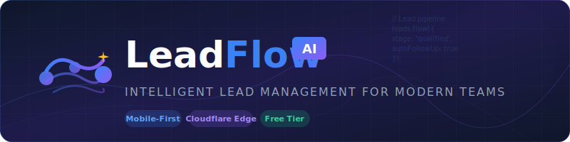
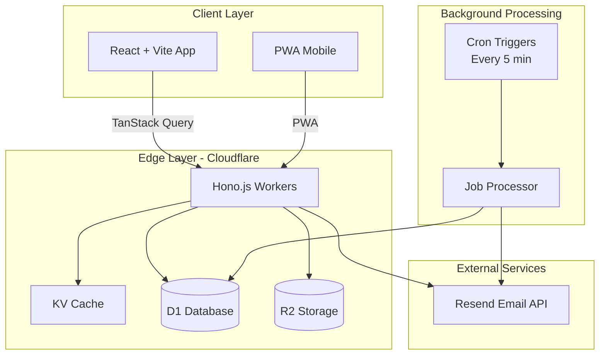

<div align="center">



<br/>
<br/>

[](https://opensource.org/licenses/MIT)
[](https://workers.cloudflare.com/)
[](https://www.typescriptlang.org/)
[](https://reactjs.org/)

### **The Mobile-First CRM Built for the Edge**

*Capture leads. Manage pipelines. Automate follow-ups. Zero infrastructure costs.*

**[🚀 Quick Start](#-quick-start) • [📖 Documentation](#-documentation) • [🎯 Features](#-features) • [🏗️ Architecture](#️-architecture)**

</div>

---

## ✨ Why LeadFlow AI?

<table>
<tr>
<td width="50%">

### 🎯 Built for Small Teams
Designed specifically for small businesses and startups who need powerful CRM capabilities without the enterprise price tag. Mobile-first design ensures your team can manage leads on-the-go.

</td>
<td width="50%">

### 💰 100% Free Tier Compatible
Runs entirely on Cloudflare's free tier. No hidden costs, no surprise bills. Scale when you're ready, stay free as long as you need.

</td>
</tr>
<tr>
<td width="50%">

### ⚡ Edge-First Performance
Built on Cloudflare's global network with 300+ data centers worldwide. Sub-millisecond response times, no cold starts, instant scalability.

</td>
<td width="50%">

### 🔒 Enterprise-Grade Security
JWT authentication with refresh tokens, bcrypt password hashing, multi-tenant isolation, and input sanitization. Security by design, not as an afterthought.

</td>
</tr>
</table>

---

## 🎯 Features

<table>
<tr>
<th width="25%">Feature</th>
<th>Description</th>
</tr>
<tr>
<td><strong>📊 Kanban Pipeline</strong></td>
<td>Visual drag-and-drop pipeline with stages: New → Contacted → Qualified → Proposal → Won/Lost. Card-based UI optimized for mobile with max 2-3 taps per action.</td>
</tr>
<tr>
<td><strong>📧 Email Automation</strong></td>
<td>Automated follow-up emails via Resend integration. Cron-based job processing eliminates the need for paid queue services. 3,000 emails/month free.</td>
</tr>
<tr>
<td><strong>📈 Real-time Dashboard</strong></td>
<td>Live statistics with KV-cached aggregations. Pipeline conversion rates, lead sources, monthly trends, and team performance metrics.</td>
</tr>
<tr>
<td><strong>👥 Team Collaboration</strong></td>
<td>Multi-user support with role-based access. Invite team members, assign leads, track activities. Full audit trail with timeline view.</td>
</tr>
<tr>
<td><strong>📁 CSV Exports</strong></td>
<td>Export leads to CSV with R2 storage. Generate reports, backup data, or import into other systems. Unlimited exports.</td>
</tr>
<tr>
<td><strong>📱 Mobile-First UX</strong></td>
<td>Touch-optimized interface with gesture support. Swipe actions, pull-to-refresh, bottom navigation. Works offline with service worker caching.</td>
</tr>
<tr>
<td><strong>🔔 Smart Notifications</strong></td>
<td>Real-time alerts for new leads, follow-up reminders, and pipeline changes. Email digest for daily summaries.</td>
</tr>
<tr>
<td><strong>🎨 Customizable Pipelines</strong></td>
<td>Create custom stages, define probability percentages, set automation rules. Adapt the CRM to your unique sales process.</td>
</tr>
</table>

---

## 🏗️ Architecture

<div align="center">



</div>

### Technology Stack

| Layer | Technology | Purpose |
|-------|------------|---------|
| **Frontend** | React 18 + Vite | Ultra-fast development with HMR |
| **State Management** | TanStack Query v5 | Server state with automatic caching |
| **Styling** | Tailwind CSS 4 | Mobile-first, utility-first CSS |
| **Backend** | Hono.js | Ultra-fast, TypeScript-native framework |
| **Database** | Cloudflare D1 | SQLite at the edge, 5GB free |
| **Cache** | Cloudflare KV | Sub-millisecond reads, 1GB free |
| **Storage** | Cloudflare R2 | Zero egress fees, 10GB free |
| **Email** | Resend | Developer-friendly email API, 3K/month free |
| **Jobs** | Cron Triggers | Free scheduled tasks processing |

---

## 🚀 Quick Start

### Prerequisites

- Node.js 18+ 
- npm or pnpm
- Cloudflare account ([sign up free](https://dash.cloudflare.com/sign-up))
- Resend account ([sign up free](https://resend.com/signup))

### 1️⃣ Clone & Install

```bash
# Clone the repository
git clone https://github.com/vertiljivenson9/LeadFlow.ia.git
cd LeadFlow.ia

# Install dependencies
npm install
cd backend && npm install
cd ../frontend && npm install
```

### 2️⃣ Create Cloudflare Resources

```bash
# Login to Cloudflare
npx wrangler login

# Create D1 Database
npx wrangler d1 create leadflow-db
# 📋 Copy the database_id shown

# Create KV Namespace
npx wrangler kv:namespace create KV
# 📋 Copy the id shown

# Create R2 Bucket
npx wrangler r2 bucket create leadflow-exports
```

### 3️⃣ Configure Environment

Update `backend/wrangler.toml` with your resource IDs:

```toml
name = "leadflow-api"
main = "src/index.ts"
compatibility_date = "2024-01-01"

[[d1_databases]]
binding = "DB"
database_name = "leadflow-db"
database_id = "YOUR_DATABASE_ID"  # ← Paste here

[[kv_namespaces]]
binding = "KV"
id = "YOUR_KV_ID"  # ← Paste here

[[r2_buckets]]
binding = "R2"
bucket_name = "leadflow-exports"

[triggers]
crons = ["*/5 * * * *"]  # Process emails every 5 minutes
```

### 4️⃣ Set Secrets

```bash
cd backend

# Generate secrets (use strong random strings)
npx wrangler secret put JWT_SECRET
# Enter: your-super-secret-jwt-key-min-32-chars

npx wrangler secret put JWT_REFRESH_SECRET
# Enter: your-different-refresh-secret-key

npx wrangler secret put RESEND_API_KEY
# Enter: re_your_resend_api_key
```

### 5️⃣ Initialize Database

```bash
# Run migrations
npx wrangler d1 execute leadflow-db --file=../migrations/0001_init.sql
```

### 6️⃣ Deploy

```bash
# Deploy Backend
cd backend
npx wrangler deploy

# Deploy Frontend
cd ../frontend
npm run build
npx wrangler pages deploy dist --project-name=leadflow-ai
```

🎉 **Done!** Your CRM is now live on Cloudflare's global network.

---

## 📖 Documentation

<details>
<summary><strong>🔧 Development Setup</strong></summary>

### Local Development

```bash
# Terminal 1: Backend
cd backend
npm run dev
# → http://localhost:8787

# Terminal 2: Frontend
cd frontend
npm run dev
# → http://localhost:5173
```

### Environment Variables (Local)

Create `backend/.dev.vars`:

```env
JWT_SECRET=dev-jwt-secret-key-for-testing
JWT_REFRESH_SECRET=dev-refresh-secret-key
RESEND_API_KEY=re_your_test_api_key
```

### Database Management

```bash
# View database
npx wrangler d1 info leadflow-db

# Run ad-hoc SQL
npx wrangler d1 execute leadflow-db --command="SELECT * FROM leads LIMIT 10"

# Check pending jobs
npx wrangler d1 execute leadflow-db --command="SELECT * FROM queue_jobs WHERE status='pending'"
```

</details>

<details>
<summary><strong>🔐 Authentication Flow</strong></summary>

### JWT Token Strategy

LeadFlow AI uses a dual-token authentication system:

| Token Type | Lifetime | Purpose | Storage |
|------------|----------|---------|---------|
| Access Token | 15 minutes | API authentication | Memory (React state) |
| Refresh Token | 7 days | Obtain new access tokens | HttpOnly cookie + KV |

### Security Features

- **bcrypt** password hashing (12 rounds)
- **JWT** with HS256 algorithm
- **HttpOnly** cookies for refresh tokens
- **Automatic token refresh** on 401 responses
- **Secure logout** with token invalidation

### Multi-Tenant Isolation

Every query is automatically scoped to the user's organization:

```typescript
// All leads queries include organization filter
const leads = await db.prepare(`
  SELECT * FROM leads 
  WHERE organization_id = ?
`).bind(user.organizationId).all();
```

</details>

<details>
<summary><strong>📧 Email System</strong></summary>

### How It Works (Free Alternative to Queues)

Instead of paying $5/month for Cloudflare Queues, we use a clever combination of D1 database tables and Cron Triggers:

```
┌─────────────┐     ┌──────────────┐     ┌─────────────┐
│  Lead       │     │ queue_jobs   │     │ Cron Trigger│
│  Created    │────▶│ table (D1)   │────▶│ (every 5min)│
└─────────────┘     └──────────────┘     └──────┬──────┘
                                                │
                                                ▼
                                         ┌──────────────┐
                                         │   Resend     │
                                         │   Email API  │
                                         └──────────────┘
```

### Benefits

- ✅ **Zero cost** - Cron Triggers are free on Cloudflare
- ✅ **Persistent** - Jobs stored in D1, never lost
- ✅ **Retry logic** - Automatic retries with exponential backoff
- ✅ **Full audit** - All emails logged in `email_logs` table

### Manual Job Processing

If you need to process jobs immediately:

```bash
curl -X POST https://your-worker.workers.dev/api/admin/process-jobs \
  -H "Authorization: Bearer YOUR_JWT_TOKEN"
```

</details>

<details>
<summary><strong>📊 API Reference</strong></summary>

### Authentication

| Endpoint | Method | Description |
|----------|--------|-------------|
| `/api/auth/register` | POST | Create new account |
| `/api/auth/login` | POST | Authenticate user |
| `/api/auth/refresh` | POST | Refresh access token |
| `/api/auth/logout` | POST | Invalidate session |
| `/api/auth/me` | GET | Get current user |

### Leads

| Endpoint | Method | Description |
|----------|--------|-------------|
| `/api/leads` | GET | List leads (paginated, filterable) |
| `/api/leads` | POST | Create new lead |
| `/api/leads/:id` | GET | Get lead details |
| `/api/leads/:id` | PUT | Update lead |
| `/api/leads/:id` | DELETE | Delete lead |
| `/api/leads/:id/stage` | PATCH | Move lead to new stage |

### Dashboard

| Endpoint | Method | Description |
|----------|--------|-------------|
| `/api/dashboard/stats` | GET | Get pipeline statistics |
| `/api/dashboard/trends` | GET | Get monthly trends |

### Export

| Endpoint | Method | Description |
|----------|--------|-------------|
| `/api/export/csv` | GET | Export leads to CSV |
| `/api/export/download/:key` | GET | Download exported file |

### Example Request

```bash
# Create a lead
curl -X POST https://your-api.workers.dev/api/leads \
  -H "Authorization: Bearer YOUR_TOKEN" \
  -H "Content-Type: application/json" \
  -d '{
    "name": "John Doe",
    "email": "john@example.com",
    "phone": "+1234567890",
    "company": "Acme Corp",
    "value": 5000,
    "source": "Website",
    "notes": "Interested in enterprise plan"
  }'
```

</details>

<details>
<summary><strong>💰 Cost Breakdown</strong></summary>

### Free Tier Limits

| Service | Free Limit | What Happens When Exceeded |
|---------|------------|---------------------------|
| Workers | 100,000 requests/day | Returns 429 Too Many Requests |
| D1 | 5M rows read/day | Queries fail |
| KV | 100,000 reads/day | Reads fail |
| R2 | 10GB storage | Uploads fail |
| Resend | 3,000 emails/month | Emails not sent |

### Estimated Capacity

For a typical small business:

| Metric | Estimate |
|--------|----------|
| Daily active users | Up to 50 |
| Leads per month | Up to 5,000 |
| Emails per month | Up to 3,000 |
| Data storage | Up to 1GB |

**Total monthly cost: $0** 🎉

### Scaling Beyond Free

When you outgrow the free tier:

| Plan | Cost | What You Get |
|------|------|--------------|
| Workers Paid | $5/mo | 10M requests, no limits |
| D1 Paid | $5/mo | 25M rows read, more storage |
| Resend Pro | $20/mo | 10K emails, custom domain |

</details>

---

## 📁 Project Structure

```
LeadFlow.ia/
├── 📁 backend/
│   ├── 📁 src/
│   │   ├── 📄 index.ts              # App entry + Cron handler
│   │   ├── 📁 routes/
│   │   │   ├── 📄 auth.ts           # Authentication endpoints
│   │   │   ├── 📄 leads.ts          # Lead CRUD operations
│   │   │   ├── 📄 dashboard.ts      # Stats & analytics
│   │   │   ├── 📄 export.ts         # CSV export functionality
│   │   │   └── 📄 team.ts           # Team management
│   │   ├── 📁 services/
│   │   │   ├── 📄 email.ts          # Resend integration
│   │   │   ├── 📄 job-processor.ts  # Cron-based job queue
│   │   │   └── 📄 dashboard.ts      # Stats aggregation
│   │   └── 📁 middleware/
│   │       └── 📄 auth.ts           # JWT verification
│   ├── 📄 wrangler.toml             # Cloudflare config
│   └── 📄 package.json
│
├── 📁 frontend/
│   ├── 📁 src/
│   │   ├── 📁 pages/
│   │   │   ├── 📄 Dashboard.tsx     # Main dashboard
│   │   │   ├── 📄 Leads.tsx         # Kanban pipeline
│   │   │   ├── 📄 LeadDetail.tsx    # Lead timeline view
│   │   │   ├── 📄 Login.tsx         # Authentication
│   │   │   ├── 📄 Register.tsx      # Account creation
│   │   │   └── 📄 Settings.tsx      # User settings
│   │   ├── 📁 components/
│   │   │   ├── 📄 LeadCard.tsx      # Pipeline card
│   │   │   ├── 📄 LeadFormModal.tsx # Create/edit form
│   │   │   └── 📄 Layout.tsx        # App shell
│   │   ├── 📁 contexts/
│   │   │   └── 📄 AuthContext.tsx   # Auth state management
│   │   ├── 📁 lib/
│   │   │   ├── 📄 api.ts            # Fetch client
│   │   │   └── 📄 queries.ts        # TanStack Query hooks
│   │   └── 📄 App.tsx               # React Router setup
│   └── 📄 package.json
│
├── 📁 migrations/
│   └── 📄 0001_init.sql             # Database schema
│
├── 📁 tests/
│   └── 📄 backend.test.ts           # API tests
│
├── 📁 assets/
│   ├── 📄 logo.svg                  # Logo (SVG)
│   └── 📄 banner.svg                # README banner
│
├── 📄 README.md                     # This file
├── 📄 DEPLOYMENT.md                 # Deployment guide
└── 📄 package.json                  # Workspace root
```

---

## 🤝 Contributing

We welcome contributions! Please see our [Contributing Guide](CONTRIBUTING.md) for details.

### Development Workflow

1. Fork the repository
2. Create a feature branch (`git checkout -b feature/amazing-feature`)
3. Commit your changes (`git commit -m 'Add amazing feature'`)
4. Push to the branch (`git push origin feature/amazing-feature`)
5. Open a Pull Request

### Code Style

- **TypeScript** strict mode enabled
- **ESLint** + **Prettier** for formatting
- **Conventional Commits** for commit messages
- **Husky** for pre-commit hooks

---

## 📝 License

This project is licensed under the MIT License - see the [LICENSE](LICENSE) file for details.

---

## 🙏 Acknowledgments

- [Cloudflare](https://cloudflare.com) for the incredible free tier
- [Hono.js](https://hono.dev) for the blazing-fast web framework
- [Resend](https://resend.com) for developer-friendly email API
- [Tailwind CSS](https://tailwindcss.com) for the utility-first CSS framework
- [TanStack Query](https://tanstack.com/query) for powerful data synchronization

---

<div align="center">

### Built with ❤️ for small businesses worldwide

**[⬆ Back to Top](#-why-leadflow-ai)**


</div>
